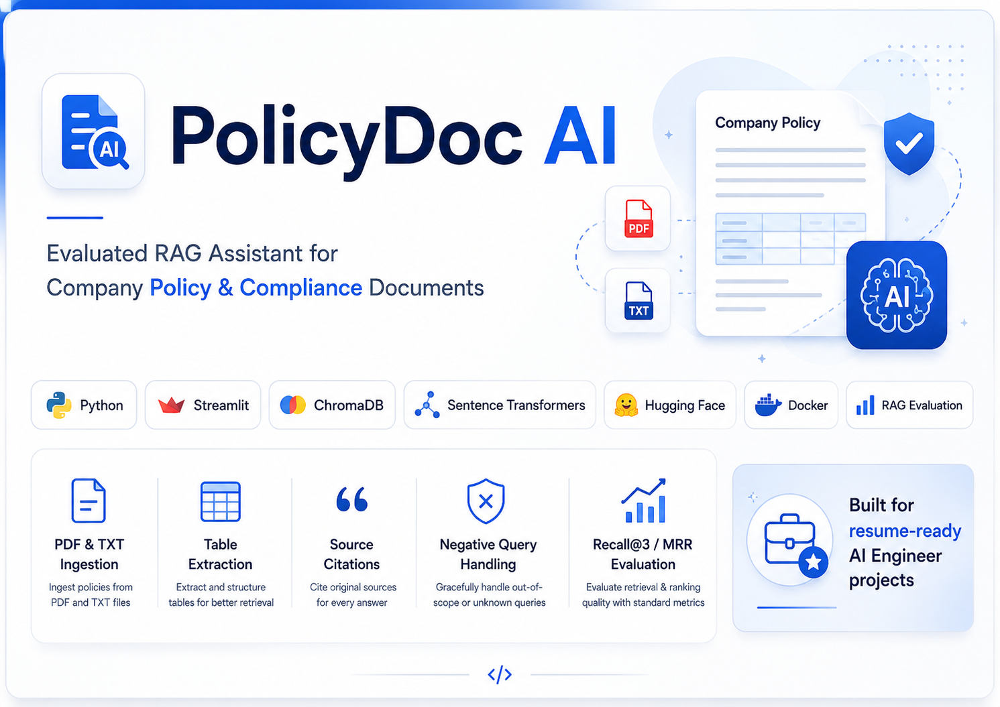
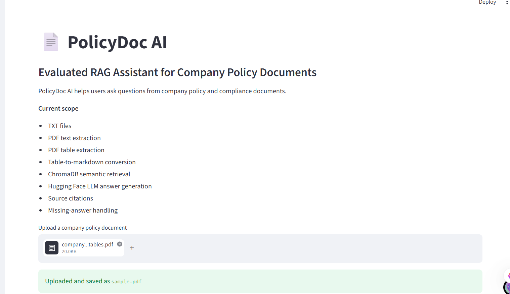
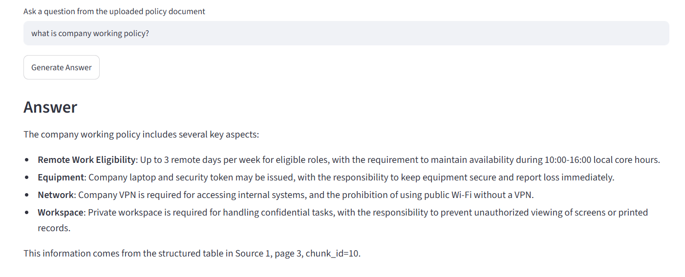
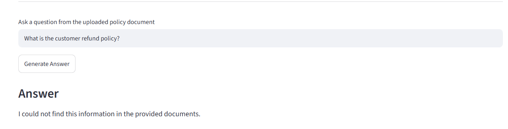
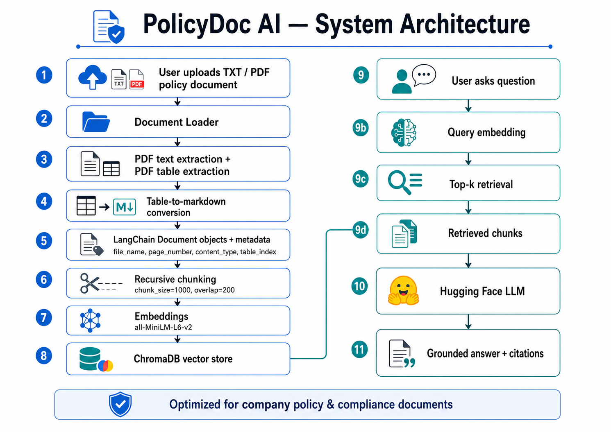
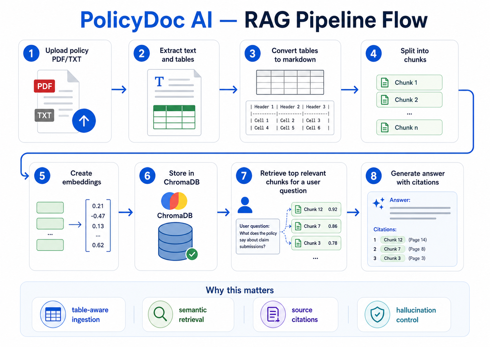
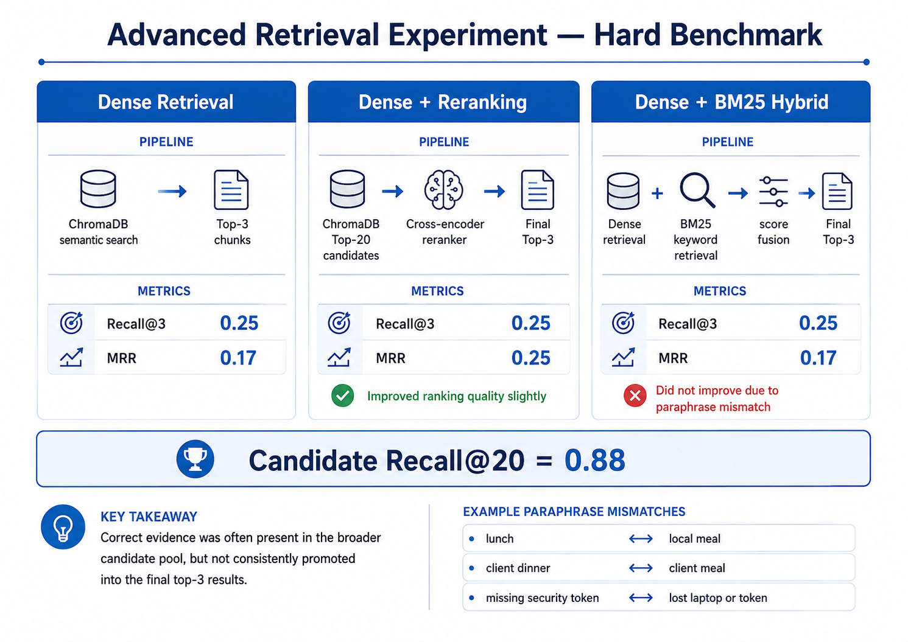

# PolicyDoc AI

<p align="center">
  
</p>

## Evaluated RAG Assistant for Company Policy & Compliance Documents

PolicyDoc AI is an end-to-end Retrieval-Augmented Generation system built for company policy and compliance documents.

It allows users to upload TXT or PDF policy documents, extract text and tables, convert tables into markdown, store document chunks in ChromaDB, retrieve relevant evidence, and generate grounded answers with source citations.

Unlike a basic “chat with PDF” project, PolicyDoc AI focuses on practical AI Engineering features such as:

- PDF and TXT document ingestion
- PDF table extraction
- Table-to-markdown conversion
- Metadata-based citations
- Evaluated chunking strategy
- ChromaDB vector search
- Hugging Face LLM answer generation
- Missing-answer handling to reduce hallucination
- Streamlit UI
- Docker support
- Advanced retrieval experiments on harder policy documents


<p align="center">
  
  
  
  
  
  
  
</p>

---

## Problem Statement

Companies store important operational knowledge inside long policy and compliance documents such as:

- employee handbooks
- leave and attendance policies
- expense reimbursement policies
- data access policies
- security incident reporting documents
- document retention and compliance manuals

These documents often contain dense paragraphs, tables, exceptions, approval rules, and page-specific clauses. Searching manually through them is slow and error-prone.

Employees may ask questions like:

```txt
What is the local meal reimbursement limit?
How many remote work days are allowed per week?
Who can access restricted documents?
How quickly should a lost laptop be reported?
What is the customer refund policy?


A normal LLM may answer from general knowledge and hallucinate. In policy and compliance use cases, this is risky because answers must be grounded in the actual company document.

PolicyDoc AI solves this by using Retrieval-Augmented Generation:

User question
   ↓
Retrieve relevant policy evidence from uploaded documents
   ↓
Generate an answer only from retrieved context
   ↓
Show source citations

The system is designed to answer only when supporting evidence is available. If the uploaded document does not contain the answer, it returns an insufficient-context response instead of guessing.

---

## Demo Screenshots

### 1. Upload and Index Policy Document

The user can upload a company policy PDF or TXT file and index it into ChromaDB.

<p align="center">
  
</p>

---

### 2. Policy Question Answering with Citations

Example question:

```txt
What is company working policy?

The system retrieves relevant policy evidence and generates an answer with citations.

<p align="center">  </p>

3. Negative Question / Missing Policy Handling

Example question:

What is the customer refund policy?

Since the uploaded document does not contain a customer refund policy, the system refuses to guess.

<p align="center">  </p> ```

---

## Key Features

PolicyDoc AI is designed as a practical RAG system for policy and compliance documents, not just a basic PDF chatbot.

| Feature | Description |
|---|---|
| **TXT/PDF ingestion** | Supports text files and text-based PDF policy documents. |
| **PDF text extraction** | Extracts page-wise text from PDF documents. |
| **PDF table extraction** | Extracts tables separately instead of treating them as noisy text. |
| **Table-to-markdown conversion** | Converts extracted tables into markdown format to preserve header-value relationships. |
| **Metadata-based citations** | Stores file name, page number, content type, table index, chunk ID, and chunk length. |
| **Evaluated chunking strategy** | Uses tested chunk size and overlap instead of random values. |
| **Semantic retrieval** | Uses sentence-transformer embeddings and ChromaDB for vector search. |
| **LLM answer generation** | Uses a Hugging Face LLM to generate grounded answers from retrieved context. |
| **Source citations** | Shows which file, page, chunk, and content type were used for the answer. |
| **Negative-question handling** | Returns an insufficient-context response when the answer is not present in the document. |
| **Streamlit UI** | Provides an interactive interface for uploading documents and asking questions. |
| **Docker support** | Includes Docker setup for containerized local deployment. |
| **Advanced retrieval experiments** | Compares dense retrieval, reranking, and hybrid retrieval on a harder benchmark. |

---

## Why This Is More Than a Basic PDF Chatbot

| Basic PDF Chatbot | PolicyDoc AI |
|---|---|
| Usually supports only simple PDF text | Supports TXT, PDF text, and PDF tables |
| Often ignores tables | Extracts tables and converts them to markdown |
| Uses random chunk size | Uses evaluated chunking strategy |
| Retrieves chunks without evaluation | Evaluates retrieval using Recall@3 and MRR |
| May hallucinate missing answers | Handles missing-policy questions safely |
| Often has no citations | Provides metadata-based source citations |
| Usually has no failure analysis | Includes hard benchmark and retrieval experiments |
| Demo only | Streamlit UI + Docker support |

---

## Architecture

PolicyDoc AI follows a complete Retrieval-Augmented Generation pipeline. The system first converts uploaded policy documents into searchable chunks, stores them in ChromaDB, and then retrieves relevant evidence before generating an answer.

<p align="center">
  
</p>

### High-Level Flow

```txt
User uploads policy PDF/TXT
        ↓
Document Loader
        ↓
PDF text extraction + PDF table extraction
        ↓
Table-to-markdown conversion
        ↓
LangChain Document objects with metadata
        ↓
Recursive chunking
        ↓
Sentence-transformer embeddings
        ↓
ChromaDB vector database
        ↓
User asks a question
        ↓
Top-k retrieval
        ↓
Hugging Face LLM answer generation
        ↓
Grounded answer with source citations


RAG Pipeline Flow
<p align="center">  </p>

The pipeline has two major stages:

1. Indexing Stage

In the indexing stage, the uploaded document is processed and stored for retrieval.

Document → text/table extraction → chunking → embeddings → ChromaDB

This stage creates searchable chunks with metadata such as:

file_name
page_number
content_type
table_index
chunk_id
chunk_length
2. Query Stage

In the query stage, the user question is converted into an embedding and compared with stored chunk embeddings.

Question → query embedding → semantic retrieval → LLM answer → citations

The final answer is generated only from retrieved context. If the answer is missing from the document, the system returns an insufficient-context response instead of guessing.


---

## Document Ingestion and Table Handling

PolicyDoc AI supports two document types in the current version:

```txt
.txt
.pdf

The ingestion layer is implemented in:

app/loaders.py
TXT Loading

For .txt files, the loader reads the full text and converts it into a LangChain Document object with metadata.

Example metadata:

{
    "file_name": "policy_notes.txt",
    "file_type": "txt",
    "content_type": "text",
    "page_number": None
}
PDF Loading

For .pdf files, the loader extracts:

Page-wise text
Tables
Page number
Content type
Table index

Each extracted page or table becomes a separate LangChain Document.

Example text metadata:

{
    "file_name": "sample.pdf",
    "file_type": "pdf",
    "content_type": "text",
    "page_number": 4
}

Example table metadata:

{
    "file_name": "sample.pdf",
    "file_type": "pdf",
    "content_type": "table",
    "page_number": 4,
    "table_index": 1
}
Why Table Extraction Matters

Company policy documents often store important values inside tables.

Examples:

leave allowance
reimbursement limits
access-control permissions
document retention periods
incident reporting deadlines

If tables are treated as plain text, header-value relationships can become unclear.

For example, this table row:

Local Meal | USD 25 per person | Required for all claims | Alcohol is not reimbursable

is much more useful when preserved as structured markdown:

| Expense Category | Limit | Receipt Required | Notes |
|---|---|---|---|
| Local Meal | USD 25 per person | Required for all claims | Alcohol is not reimbursable |

This helps the retrieval system and the LLM understand which value belongs to which policy field.

Metadata-Based Citations

Every chunk keeps metadata such as:

file_name
page_number
content_type
table_index
chunk_id
chunk_length

This metadata is used to show citations in the final answer.

Example citation:

Source 1: file=sample.pdf, page=4, chunk_id=11, content_type=text
Source 2: file=sample.pdf, page=4, chunk_id=13, content_type=table

This is important because policy and compliance answers must be traceable back to the original document.

---

## Chunking Strategy

After loading the document, PolicyDoc AI splits the extracted text and table content into smaller chunks.

Chunking is important because:

- LLMs have limited context windows.
- Very large chunks may mix unrelated policy topics.
- Very small chunks may lose important context.
- Retrieval quality depends heavily on chunk quality.

The project uses LangChain's `RecursiveCharacterTextSplitter`.

```python
CHUNK_SIZE = 1000
CHUNK_OVERLAP = 200

Why RecursiveCharacterTextSplitter?

RecursiveCharacterTextSplitter tries to split text using natural boundaries first:

paragraphs → lines → spaces → characters

This is better than blindly cutting text every fixed number of characters because it tries to preserve meaning inside each chunk.

Why Chunk Overlap?

Policy clauses often continue across sentences or paragraphs. If chunks are split with no overlap, important context may be lost at the boundary.

Example:

Chunk 1: Employees must submit reimbursement claims within 30 days...
Chunk 2: Claims submitted after the deadline may be rejected...

Without overlap, the second chunk may lose the context of what “deadline” means.

Overlap keeps a small part of the previous chunk inside the next chunk, preserving continuity.

How Chunk Size Was Selected

The chunk size was not chosen randomly.

I tested multiple configurations:

Config	Chunk Size	Overlap	Purpose
Small	500	100	More focused chunks, but more total chunks
Balanced	800	150	Middle-ground configuration
Large	1000	200	Fewer chunks with more context

The final selected configuration was:

CHUNK_SIZE = 1000
CHUNK_OVERLAP = 200

This was selected because it gave strong retrieval performance while keeping the number of chunks manageable.

---

## Embeddings and Vector Database

After chunking, each chunk is converted into a numerical vector called an embedding.

An embedding captures the semantic meaning of text, so similar meanings are placed close together in vector space.

Example:

```txt
Question: What is the meal reimbursement limit?

Relevant chunk:
Local Meal | USD 25 per person | Required for all claims

Embedding Model

PolicyDoc AI uses:

sentence-transformers/all-MiniLM-L6-v2

Reasons for choosing this model:

free and local
fast enough on CPU
suitable for semantic search
does not require paid embedding APIs
produces 384-dimensional embeddings
easy to use with sentence-transformers

This project is designed to be reproducible locally, so a local embedding model was preferred over paid embedding APIs.

ChromaDB Vector Store

The project uses local ChromaDB as the vector database.

For each chunk, ChromaDB stores:

1. chunk text
2. embedding vector
3. metadata

Example stored item:

{
    "id": "sample_chunk_13",
    "document": "| Expense Category | Limit | Receipt Required | Notes | ...",
    "embedding": [0.021, -0.113, 0.452, ...],
    "metadata": {
        "file_name": "sample.pdf",
        "page_number": 4,
        "chunk_id": 13,
        "content_type": "table"
    }
}

During retrieval:

User question
   ↓
Question converted into embedding
   ↓
ChromaDB compares question embedding with stored chunk embeddings
   ↓
Top-k most similar chunks are returned
Why Metadata Matters

Embeddings help with search, but metadata helps with trust.

PolicyDoc AI uses metadata to show citations such as:

Source 1: file=sample.pdf, page=4, chunk_id=11, content_type=text
Source 2: file=sample.pdf, page=4, chunk_id=13, content_type=table

This makes the answer traceable back to the original policy document.

Local and Free Design

The vector database runs locally using:

chromadb.PersistentClient(path=str(CHROMA_DB_PATH))

This means:

no ChromaDB account is required
no cloud vector database cost
embeddings and metadata are stored locally
the project can run offline after model downloads

For production, local ChromaDB can be replaced with a managed vector database such as Chroma Cloud, Pinecone, Weaviate, or Milvus.


---

## Answer Generation and Hallucination Control

After retrieval, the top relevant chunks are passed to a Hugging Face LLM for answer generation.

The LLM is not asked to answer from memory. Instead, it receives:

```txt
1. Retrieved document context
2. User question
3. Strict grounding instructions

The prompt tells the model to:

use only the retrieved context
avoid outside knowledge
keep the answer concise
include source citations
say when the answer is not present in the document
mention table content when the answer comes from a table
Grounded Prompting Strategy

The prompt follows this idea:

You are PolicyDoc AI, a RAG assistant for company policy and compliance documents.

Use ONLY the provided context to answer the question.

If the answer is not present in the context, say:
"I could not find this information in the provided documents."

Include citations using the source labels.

This is important because company policy answers must be traceable and should not be guessed.

Positive Answer Example

Question:

What is the local meal reimbursement limit?

Answer:

The local meal reimbursement limit is USD 25 per person.

Retrieved sources:

Source 1: file=sample.pdf, page=4, chunk_id=11, content_type=text
Source 2: file=sample.pdf, page=4, chunk_id=13, content_type=table
<p align="center">  </p>
Negative Question Handling

Question:

What is the customer refund policy?

Since the uploaded company policy document does not contain a customer refund policy, the system responds:

I could not find this information in the provided documents.
<p align="center">  </p>

This behavior is important for reducing hallucination in policy and compliance use cases.

---

## Evaluation Results

PolicyDoc AI includes retrieval evaluation instead of relying only on manual testing.

The goal of retrieval evaluation is to check:

```txt
Did the retriever bring the correct evidence into the top-k results?

For policy and compliance RAG, this matters because the LLM can only generate a correct grounded answer if the retrieval step brings the right context.

Clean Company Policy Benchmark

I created a controlled company-policy benchmark using the sample policy handbook.

The benchmark contains questions such as:

How many paid time off days are allowed per year?
How many remote work days are allowed per week?
What is the local meal reimbursement limit?
Who can access restricted documents?
How quickly should a lost laptop or token be reported?

For each question, I defined the expected source page.

Example:

{
  "question": "What is the local meal reimbursement limit?",
  "expected_page_numbers": [4]
}
Metrics Used
Metric	Meaning
Recall@3	Whether the expected source page appears in the top 3 retrieved chunks
MRR	How high the first correct retrieved result appears
Clean Benchmark Result
Benchmark	Recall@3	MRR
Company policy PDF	1.00	1.00
<p align="center">  </p>
Important Note About 1.00 Scores

The score does not mean the system has universal 100% accuracy.

It means:

On this controlled company-policy benchmark, the selected ingestion, chunking, embedding, and retrieval setup successfully retrieved the expected source page in the top 3 results.

This benchmark is useful for validating the pipeline, but production systems should be tested with:

more documents
more paraphrased questions
harder negative queries
human-labeled relevance judgments
real company policy data


---

## Advanced Retrieval Experiment

A clean benchmark is useful for validating the main pipeline, but real policy documents can be harder.

To test the system more deeply, I created a harder policy benchmark with:

- repeated policy terms
- overlapping reimbursement rules
- similar access-control clauses
- paraphrased questions
- table-heavy evidence
- missing-policy traps

The hard benchmark includes confusing wording such as:

| User Query Wording | Document Wording |
|---|---|
| lunch | local meal |
| client dinner | client meal |
| missing security token | lost laptop or token |
| normal lunch claim | local meal reimbursement |

This benchmark was designed to test whether retrieval still works when the user does not use the exact same words as the document.

---

## Retrieval Methods Compared

I compared three retrieval approaches:

| Method | Description |
|---|---|
| **Dense Retrieval** | ChromaDB semantic search using sentence-transformer embeddings |
| **Dense + Reranking** | ChromaDB retrieves candidates, then a cross-encoder reranker reorders them |
| **Dense + BM25 Hybrid** | Combines semantic retrieval with BM25 keyword retrieval |

---

## Hard Benchmark Results

| Retrieval Method | Recall@3 | MRR |
|---|---:|---:|
| Dense retrieval only | 0.25 | 0.17 |
| Dense + cross-encoder reranking | 0.25 | 0.25 |
| Dense + BM25 hybrid retrieval | 0.25 | 0.17 |
| Candidate Recall@20 | 0.88 | - |

<p align="center">
  
</p>

---

## Interpretation

The hard benchmark revealed an important retrieval limitation.

Candidate Recall@20 was:

```txt
0.88

his means the correct evidence was often present somewhere in the broader top-20 candidate pool.

However, the correct evidence was not consistently promoted into the final top-3 results.

Reranking improved MRR slightly:

0.17 → 0.25

But Recall@3 did not improve.

BM25 hybrid retrieval also did not improve the hard benchmark because many difficult questions used paraphrased wording. BM25 helps with exact keyword matching, but it does not automatically solve synonym mismatch.

Example:

User says: lunch
Document says: local meal
What This Experiment Shows

This experiment shows that RAG quality depends on more than simply adding a vector database.

Important findings:

Dense retrieval works well on clean policy questions.
Harder paraphrased questions reduce retrieval quality.
Reranking can improve ranking quality, but only if the right evidence is present and the reranker understands the task.
BM25 helps exact keyword matching, but not synonym mismatch.
Table-heavy policy documents need better table-aware retrieval.
Future Improvements Based on This Experiment

The hard benchmark motivated several future improvements:

1. Query Rewriting

Rewrite user questions into policy-friendly language.

Example:

normal lunch reimbursement limit
→ local meal reimbursement limit lunch meal food expense
2. Domain Synonym Expansion

Add domain-specific synonyms.

{
    "lunch": ["meal", "local meal", "food reimbursement"],
    "client dinner": ["client meal", "business meal"],
    "missing": ["lost", "loss", "not found"],
    "security token": ["token", "authentication device"]
}
3. Reciprocal Rank Fusion

Instead of simple dense + BM25 score weighting, use Reciprocal Rank Fusion to combine ranked results more robustly.

4. Row-Level Table Chunking

Instead of embedding an entire table as one chunk, each table row can be converted into a separate searchable chunk.

Example:

Expense Category: Local Meal
Limit: USD 25 per person
Receipt Required: Required for all claims
Notes: Alcohol is not reimbursable
5. Stronger Embedding Models

Benchmark stronger retrieval models such as:

BAAI/bge-small-en-v1.5
BAAI/bge-base-en-v1.5
intfloat/e5-base-v2

This section is included because real AI engineering is not only about showing perfect results. It is also about testing failure cases, analyzing limitations, and identifying the next engineering improvements.

---

## Streamlit UI

PolicyDoc AI includes a Streamlit interface so the project can be tested without running individual Python scripts.

The UI supports:

- uploading a PDF or TXT policy document
- indexing the uploaded document into ChromaDB
- asking questions from the uploaded document
- generating grounded answers
- viewing retrieved sources
- inspecting page number, chunk ID, content type, and distance score

<p align="center">
  
</p>

---

## Docker Support

The project includes Docker support for running the Streamlit app inside a container.

### Build Docker Image

```bash
docker build -t policydoc-ai .


Run Docker Container
docker run -p 8501:8501 --env-file .env policydoc-ai

Then open:

http://localhost:8501
Docker Notes

The Docker setup uses:

Python 3.11 slim image
CPU-only PyTorch
Streamlit
ChromaDB
Sentence Transformers
Hugging Face token from .env

The container disables Streamlit file watching to avoid unnecessary transformers module inspection inside Docker.

For production, the local ChromaDB directory should be mounted as a Docker volume or replaced with a managed vector database.

Example production-style volume idea:

docker run -p 8501:8501 --env-file .env -v chroma_data:/app/chroma_db policydoc-ai
Docker Files

The project contains:

Dockerfile
.dockerignore
requirements-docker.txt

requirements-docker.txt is kept separate from requirements.txt because the local Windows environment may include platform-specific packages. Docker uses a cleaner dependency file for Linux-based container builds.

---

## Installation and Usage

### 1. Clone the Repository

```bash
git clone <your-repo-url>
cd policydoc-ai

2. Create a Virtual Environment

Using uv:

uv venv

Activate the environment.

Windows:

.venv\Scripts\activate

Linux / Mac:

source .venv/bin/activate
3. Install Dependencies
uv pip install -r requirements.txt
4. Create .env File

Create a .env file in the project root:

HF_TOKEN=your_huggingface_token_here

The Hugging Face token is used for LLM answer generation through Hugging Face Inference Providers.

Do not push .env to GitHub.

5. Index the Sample Policy Document

The repository includes a sample company policy PDF:

data/uploaded_docs/sample.pdf

Run:

python app/index_documents.py

This will:

load the PDF
extract text and tables
split content into chunks
create embeddings
store chunks in ChromaDB
6. Run Retrieval Evaluation
python app/evaluation.py

If your evaluation file is named evaluate_retrieval.py, run:

python app/evaluate_retrieval.py

This generates a retrieval report at:

evaluation/retrieval_report.csv
7. Test RAG Answer Generation
python app/rag_answer.py

This runs a sample question through the full RAG pipeline.

8. Run the Streamlit App
streamlit run frontend/streamlit_app.py

Then open:

http://localhost:8501


---

## Tech Stack

| Layer | Tool / Library | Why It Is Used |
|---|---|---|
| Programming Language | Python | Main development language |
| UI | Streamlit | Interactive app for uploading documents and asking questions |
| PDF Processing | pdfplumber | Extracts text and tables from PDF files |
| Document Format | LangChain `Document` | Stores page content with metadata |
| Chunking | RecursiveCharacterTextSplitter | Splits documents into meaningful chunks |
| Embeddings | sentence-transformers/all-MiniLM-L6-v2 | Converts text chunks into semantic vectors |
| Vector Database | ChromaDB | Stores embeddings, chunks, and metadata |
| LLM | Hugging Face Inference Provider | Generates final grounded answers |
| Environment Variables | python-dotenv | Loads Hugging Face token securely |
| Evaluation | Custom Recall@3 and MRR scripts | Measures retrieval quality |
| Keyword Retrieval Experiment | rank-bm25 | Tests BM25-based hybrid retrieval |
| Reranking Experiment | CrossEncoder | Tests query-chunk reranking |
| Containerization | Docker | Runs the app inside a container |

---

## Important Project Files

| File | Purpose |
|---|---|
| `app/config.py` | Stores project paths, model names, chunk settings, retrieval settings, and collection names |
| `app/loaders.py` | Loads TXT/PDF files, extracts PDF text and tables, converts tables to markdown |
| `app/index_documents.py` | Loads documents, chunks them, creates embeddings, and stores them in ChromaDB |
| `app/retrive.py` | Tests retrieval from ChromaDB for a sample query |
| `app/rag_answer.py` | Performs retrieval, builds the RAG prompt, calls the Hugging Face LLM, and returns answers with sources |
| `app/evaluation.py` or `app/evaluate_retrieval.py` | Evaluates retrieval on the clean company-policy benchmark |
| `app/reranker.py` | Contains the cross-encoder reranking logic |
| `app/hybrid_retriever.py` | Contains dense + BM25 hybrid retrieval logic |
| `app/evaluate_hard_base.py` | Evaluates dense retrieval on the hard benchmark |
| `app/evaluate_hard_reranking.py` | Evaluates dense retrieval plus reranking on the hard benchmark |
| `app/evaluate_hard_hybrid.py` | Evaluates dense + BM25 hybrid retrieval on the hard benchmark |
| `app/debug_candidate_recall.py` | Checks whether correct evidence appears in the wider top-20 candidate pool |
| `frontend/streamlit_app.py` | Streamlit user interface |
| `evaluation/eval_questions.json` | Clean benchmark questions |
| `evaluation/hard_eval_questions.json` | Hard benchmark questions |
| `data/uploaded_docs/sample.pdf` | Clean company-policy sample PDF |
| `data/uploaded_docs/hard_evaluation.pdf` | Hard retrieval benchmark PDF |
| `Dockerfile` | Docker container definition |
| `requirements.txt` | Local Python dependencies |
| `requirements-docker.txt` | Docker-specific dependencies |


---

## Configuration

Important project settings are stored in:

```txt
app/config.py


This keeps the project maintainable because model names, paths, chunking values, and retrieval settings are defined in one place instead of being hardcoded across multiple files.

Example configuration:

CHUNK_SIZE = 1000
CHUNK_OVERLAP = 200

TOP_K = 3

EMBEDDING_MODEL_NAME = "sentence-transformers/all-MiniLM-L6-v2"

CHROMA_COLLECTION_NAME = "policy_documents"

The project also includes settings for hard benchmark experiments:

CANDIDATE_K = 20
RERANK_TOP_K = 3

RERANKER_MODEL_NAME = "cross-encoder/ms-marco-MiniLM-L-6-v2"

HYBRID_DENSE_K = 20
HYBRID_BM25_K = 20
HYBRID_FINAL_K = 3
Environment Variables

The project uses a .env file for secrets.

Create a .env file in the project root:

HF_TOKEN=your_huggingface_token_here

The Hugging Face token is used for LLM answer generation.

Do not push .env to GitHub.

The .gitignore should include:

.env
.venv/
chroma_db/
__pycache__/
*.pyc
Local ChromaDB Storage

ChromaDB is used locally through:

chromadb.PersistentClient(path=str(CHROMA_DB_PATH))

This creates a local vector database folder:

chroma_db/

The folder is ignored in Git because it can be regenerated by running:

python app/index_documents.py

This keeps the repository clean while still allowing anyone to reproduce the vector store locally.

---

## Limitations

PolicyDoc AI is a strong local RAG prototype, but it is not a full production system yet.

Current limitations:

| Limitation | Explanation |
|---|---|
| **No OCR support** | Scanned PDFs and image-only documents are not processed in the current version. |
| **No DOCX support** | Current version supports TXT and PDF only. |
| **Single-user demo design** | The Streamlit app is designed for local demo usage, not multi-user production. |
| **Local ChromaDB** | Vector storage is local. For production, a managed vector database or mounted Docker volume would be better. |
| **No authentication** | The app does not include login or user-level document isolation. |
| **Basic table chunking** | Tables are converted to markdown, but row-level table retrieval is not implemented yet. |
| **No query rewriting** | User queries are passed directly to retrieval without synonym expansion or rewriting. |
| **No full RAGAS evaluation yet** | Current evaluation uses custom Recall@3 and MRR scripts. |
| **Free LLM dependency** | Hugging Face free-tier inference may have latency or rate-limit issues. |

---

## Future Work

The hard benchmark revealed useful next-step improvements.

Planned improvements:

### 1. OCR for Scanned PDFs

Add OCR fallback for scanned or image-only documents using tools such as Tesseract or cloud OCR.

```txt
Scanned PDF → OCR extraction → text chunks → embeddings → retrieval

2. DOCX Support

Add support for .docx policy files using document loaders.

3. Query Rewriting

Rewrite user questions into policy-friendly retrieval queries.

Example:

normal lunch reimbursement limit
→ local meal reimbursement limit lunch meal food expense
4. Domain Synonym Expansion

Add domain-specific synonym mapping.

{
    "lunch": ["meal", "local meal", "food reimbursement"],
    "client dinner": ["client meal", "business meal"],
    "security token": ["token", "authentication device"],
    "missing": ["lost", "loss", "not found"]
}
5. Row-Level Table Chunking

Instead of embedding a whole table as one chunk, each table row can become a separate searchable chunk.

Example:

Expense Category: Local Meal
Limit: USD 25 per person
Receipt Required: Required for all claims
Notes: Alcohol is not reimbursable

This can improve table-specific questions.

6. Reciprocal Rank Fusion

Use Reciprocal Rank Fusion to combine dense retrieval and BM25 rankings more robustly instead of simple score weighting.

7. Stronger Embedding Models

Benchmark stronger retrieval models such as:

BAAI/bge-small-en-v1.5
BAAI/bge-base-en-v1.5
intfloat/e5-base-v2
8. RAGAS Evaluation

Add RAGAS-style metrics such as:

faithfulness
answer relevancy
context precision
context recall
9. Production Deployment

Production upgrades could include:

FastAPI backend
user authentication
user-specific document collections
cloud object storage
managed vector database
monitoring and logging
Docker volume for persistent ChromaDB storage


---

## Skills Demonstrated

This project demonstrates practical AI Engineering skills across the full RAG lifecycle:

| Area | Skills Demonstrated |
|---|---|
| Document AI | TXT/PDF ingestion, PDF text extraction, PDF table extraction |
| RAG Engineering | chunking, embeddings, vector search, context retrieval, grounded generation |
| Vector Databases | ChromaDB local vector storage, metadata-based retrieval |
| LLM Integration | Hugging Face LLM API, prompt design, context-grounded answer generation |
| Evaluation | Recall@3, MRR, clean benchmark, hard benchmark, candidate recall analysis |
| Retrieval Optimization | dense retrieval, reranking experiment, BM25 hybrid retrieval experiment |
| UI Development | Streamlit app for upload, indexing, Q&A, and source inspection |
| Deployment Basics | Dockerfile, `.dockerignore`, environment variable handling |
| Production Thinking | hallucination control, limitations analysis, future improvement planning |

---

---

## Project Status

| Component | Status |
|---|---|
| TXT/PDF ingestion | Complete |
| PDF text extraction | Complete |
| PDF table extraction | Complete |
| Table-to-markdown conversion | Complete |
| Metadata-based citations | Complete |
| Chunking strategy | Complete |
| ChromaDB vector storage | Complete |
| Hugging Face LLM answer generation | Complete |
| Negative-question handling | Complete |
| Retrieval evaluation | Complete |
| Streamlit UI | Complete |
| Docker support | Complete |
| Hard benchmark experiment | Complete |
| Reranking experiment | Complete |
| Hybrid retrieval experiment | Complete |
| OCR support | Future work |
| RAGAS evaluation | Future work |
| FastAPI backend | Future work |

---

## Final Note

PolicyDoc AI is built as a practical, evaluated RAG project for company policy and compliance documents.

The project demonstrates not only how to build a working RAG pipeline, but also how to evaluate retrieval quality, handle tables, provide citations, test failure cases, and reason about production improvements.

This makes it suitable as a portfolio project for fresher AI Engineer / ML Engineer roles.